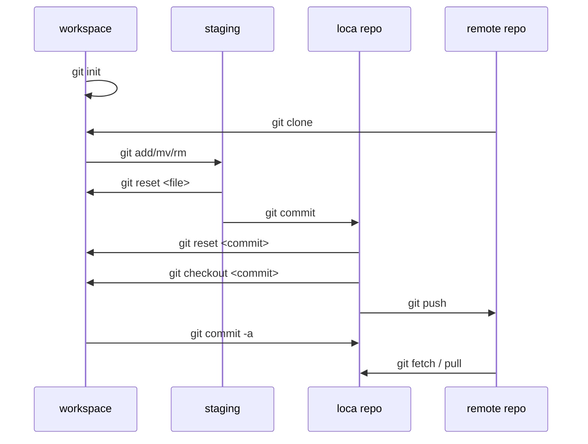

## INSTALAR GIT

GitHub le ofrece a los clientes de computadoras de escritorio que incluye una interfaz gráfica de usuario para las acciones de repositorio más comunes y una edición de línea de comando de actualización automática de Git para escenarios avanzados.

http://git-scm.com

## CONFIGURAR HERRAMIENTAS

Configura la información del usuario para todos los respositorios locales ( --globa )

Establece el nombre que desea esté anexado a sus transacciones de commit

```bash
$ git config --global user.name "[name]"
```

```bash
# Establece el e-mail que desea esté anexado a sus transacciones de commit
$ git config --global user.email "[email address]"
```

```bash
# Habilita la colores en la consola
$ git config --global color.ui auto
```

## Flujo de trabajo



### REPOSITORIOS

```bash
# Crea un nuevo repositorio local con el nombre especificado
$ git init [project-name]
```

```bash
# Descarga un proyecto y toda su historia de versión
$ git clone [url]
```

### EFECTUAR CAMBIOS

```bash
# Enumera todos los archivos nuevos o modificados que se deben confirmar
$ git status
```

```bash
# Toma una instantánea del archivo para preparar la versión
$ git add [file]
```

```bash
# Mueve el archivo del área de espera, pero preserva su contenido
$ git reset [file]
```

```bash
# Muestra las diferencias de archivos que no se han enviado aún al área de espera
$ git diff
```

```bash
# Muestra las diferencias del archivo entre el área de espera y la última versión del archivo
$ git diff --staged
```

```bash
# Registra las instantáneas del archivo permanentemente en el historial de versión
$ git commit -m "[descriptive message]"
```

### CAMBIOS GRUPALES

Nombra una serie de commits y combina esfuerzos ya culminados

```bash
# Enumera todas las ramas en el repositorio actual
$ git branch
```

```bash
# Crea una nueva rama
$ git branch [branch-name]
```

```bash
# Cambia a la rama especificada y actualiza el directorio activo
$ git checkout [branch-name]
```

```bash
# Combina el historial de la rama especificada con la rama actual
$ git merge [branch]
```

```bash
# Borra la rama especificad
$ git branch -d [branch-name]
```

### SINCRONIZACION

```bash
# Descarga todo el historial del marcador del repositorio
$ git fetch
```

```bash
# Combina la rama del marcador con la rama local actual
$ git merge [bookmark]/[branch]
```

```bash
# Carga todos los commits de la rama local al GitHub
$ git push [alias] [branch]
```

```bash
# Descarga el historial del marcador e incorpora cambios
$ git pull
```

### HISTORIAL

```bash
$ git log
# Enumera el historial de la versión para la rama actual
```

```bash
# Enumera el historial de versión para el archivo, incluidos los cambios de nombre
$ git log --follow [file]
```

```bash
# Muestra las diferencias de contenido entre dos ramas
$ git diff [first-branch]...[second-branch]
```

```bash
# Produce metadatos y cambios de contenido del commit especificado
$ git show [commit]
```


## Fuentes de información

### Libros

[Libro oficial (gratuito)](https://git-scm.com/book/es/v2)

### Videos





