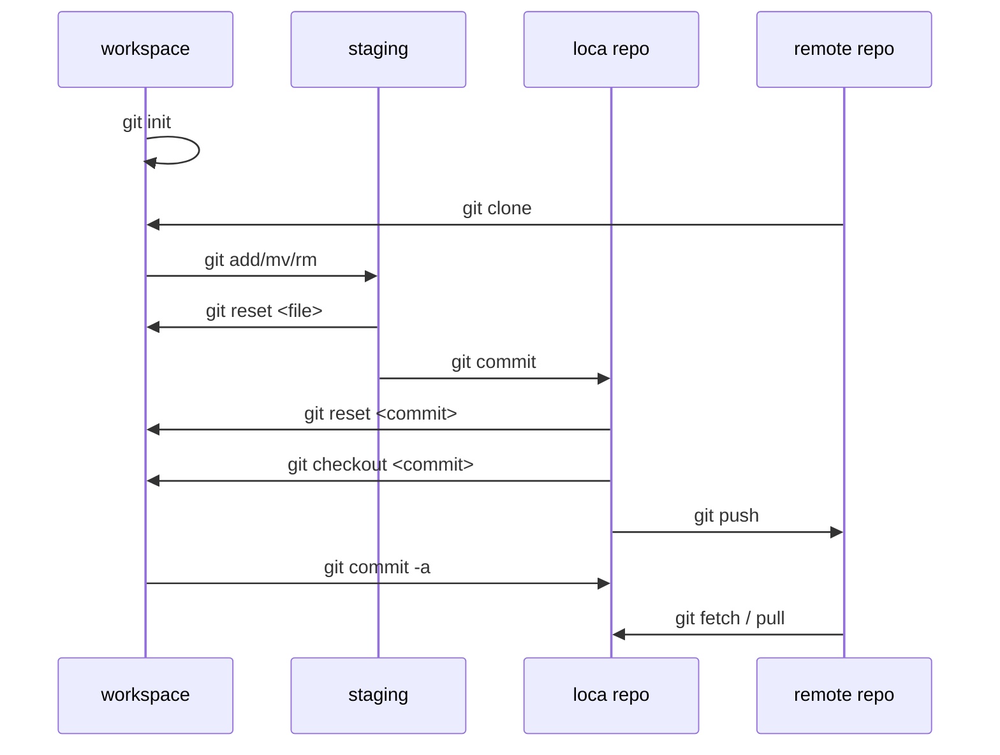

## INSTALAR GIT
GitHub le ofrece a los clientes de computadoras de escritorio que incluye una interfaz gráfica de usuario para las acciones de repositorio más comunes y una edición de línea de comando de actualización automática de Git para escenarios avanzados.

http://git-scm.com


## CONFIGURAR HERRAMIENTAS
Configura la información del usuario para todos los respositorios locales ( --globa )

Establece el nombre que desea esté anexado a sus transacciones de commit

```bash
$ git config --global user.name "[name]"
```
```bash
# Establece el e-mail que desea esté anexado a sus transacciones de commit
$ git config --global user.email "[email address]"
```

```bash
# Habilita la colores en la consola
$ git config --global color.ui auto
```
## Flujo de trabajo




Inicia un nuevo repositorio u obtiene uno de una URL existente
$ git init [project-name]
Crea un nuevo repositorio local con el nombre especificado
$ git clone [url]
Descarga un proyecto y toda su historia de versión

## Fuentes de informacion
### Videos





